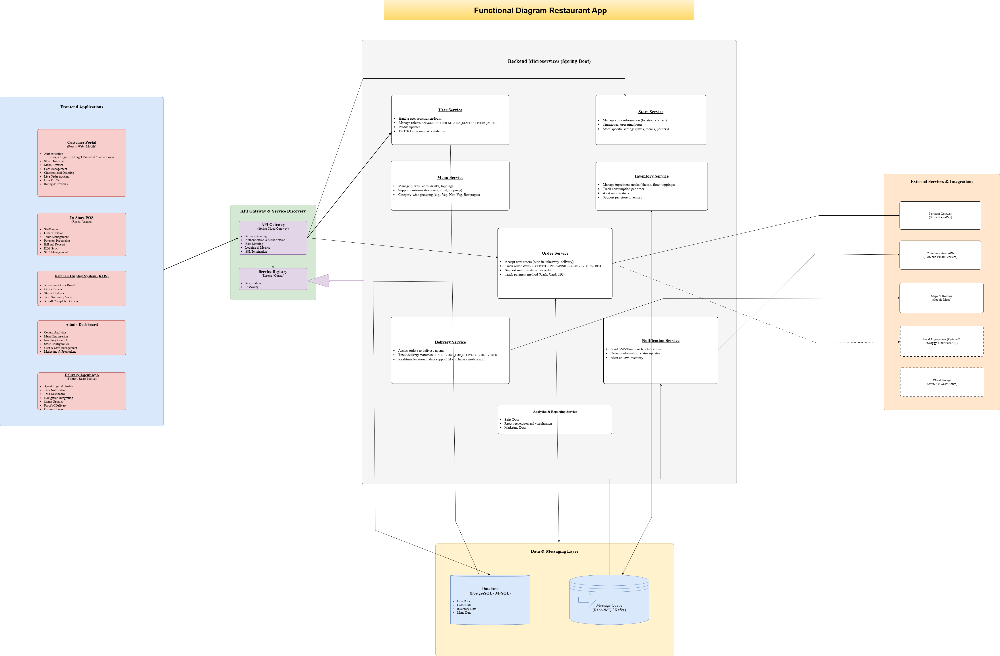

# Pizza Chain POS System

A microservices-based POS system for a pizza restaurant chain using Java Spring Boot, React, and PostgreSQL.

---

## 📦 Services

| Service          | Description                          |
|------------------|--------------------------------------|
| User Service     | User login, JWT, role management     |
| Order Service    | Order creation, status tracking      |
| Menu Service     | Menu CRUD and customization options  |
| Delivery Service | Delivery tracking & assignment       |
| Inventory        | Ingredient stock tracking            |
| Notification     | Email/SMS notifications              |
| Analytics        | Sales reports and order analytics    |
| Gateway          | Entry point for all services         |
| Registry         | Service discovery (Eureka/Consul)    |

---

## 🛠 Tech Stack

- Backend: Spring Boot, JPA, Spring Security, RabbitMQ
- Frontend: React.js, Tailwind CSS
- Messaging: Kafka / RabbitMQ
- Database: PostgreSQL
- Deployment: Docker, Render, Kubernetes (future)

---

## 🗂 Docs

- 
- [Open in draw.io](https://tinyurl.com/RAFDdrawio)

---

## 🌐 Live Demo

Backend API is live at:  
👉 https://pizzachain-backend.onrender.com

You can test using tools like Postman or cURL.

---

## ⚙️ Environment Configuration

The backend is configured to read sensitive values from a `.env` file.  
Create a `.env` file in your root directory with the following content:

    SPRING_DATASOURCE_URL=jdbc:postgresql://your-render-host:5432/pizzadb_yktz
    SPRING_DATASOURCE_USERNAME=your_username
    SPRING_DATASOURCE_PASSWORD=your_password
    SPRING_JPA_HIBERNATE_DDL_AUTO=update
    SPRING_JPA_SHOW_SQL=true


🛑 Make sure to add `.env` to `.gitignore`:

`.env
`

`application-*.properties`


---

## 🚀 Deployment (Render)

Backend is deployed using Docker on Render.

### Deployment Steps

1. Create a PostgreSQL instance on Render.
2. Set the following environment variables in Render Dashboard:
    - `SPRING_DATASOURCE_URL`
    - `SPRING_DATASOURCE_USERNAME`
    - `SPRING_DATASOURCE_PASSWORD`
    - `SPRING_JPA_HIBERNATE_DDL_AUTO=update`
    - `SPRING_JPA_SHOW_SQL=true`
3. Use the following Dockerfile in your project root:

```dockerfile
FROM openjdk:17
ARG JAR_FILE=target/*.jar
COPY ${JAR_FILE} app.jar
ENTRYPOINT ["java","-jar","/app.jar"]

